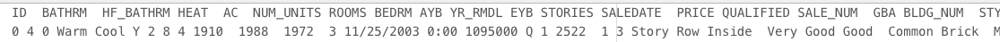
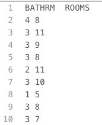
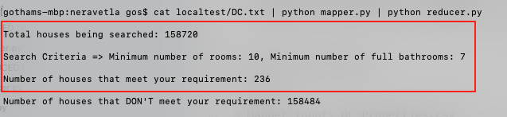

# Data Processing
- Course: BigData
- Project number: 4
- Developer Pair 1- Kyle Thompson, Goutham Neravetla, Sumnima Rana
- Developer Pair 2- Krishna Veni Karri, Pappu Shah

## Links
- [Webpage](https://sumnimarana1.github.io/MapReduceProjectGroup4/ "MapReduce Project group 4")
- [Source](https://github.com/sumnimarana1/MapReduceProjectGroup4 "MapReduce Project group 4")

## Introduction

We are using two datasets in our project.
One is real estate data which is structured data and the other is unstructured data related to social movement metoo.

Dataset 1: WashingtonDC real estate dataset
Dataset 2: 300k #metoo tweets.

## Data Source
- [DC Residential Properties](https://www.kaggle.com/christophercorrea/dc-residential-properties "Website for dataset")
This datasets has analysis showing real property information, including most recent sales price as of July 2018, for properties located Washington, D.C.Data is in CSV format and has 49 columns. Some of the attributes are ID, BATHRMNumber of Full Bathrooms, HF_BATHRM(Number of Half Bathrooms), HEATHeating, ACCooling, NUM_UNITS, etc.

- [#metoo Dataset](https://data.world/rdeeds/350k-metoo-tweets)
This is a data set which has tweets related to social movement metoo from October 2017 to february 2018. Data is in CSV format and has 16 columns. Some of the attributes are tweet_id, tweet text, timestamp of the tweet, handle etc.

## The Challenge

**5 V’s for WashingtonDC Dataset**
- Volume- There are 159K rows and 49 Col and size is 52.81 MB
- Velocity- The last update for the Datasets was done 3 Months ago.
- Value- This datas can be used to predict the property for the future business and help buyers and seller and know if its reasonable for you or not.
- Variety- Pretty structured with numerical and nominal(categorical)
- Veracity- Downloaded from Kaggle dataset which is trusted site for the dataset.

**5 V’s for datasets**
- Volume- The size of the 122.82 MB
- Velocity- Using the API’s we can retrieve approximately 4000 live stream tweets in 30 seconds. The dataset is last updated on February 2018
- Value- This dataset provide insight of impact of social media on society and the swing of the movement.
- Variety- This data is combination of text and numerical data
- Veracity- We downloaded it from DataWorld which is trusted site for the dataset and scrapped using twitter bot. So we think it is accurate.

## Big Data Questions
- Count the number of houses that have more than or equal to 10 rooms and 7 full bathrooms  - Goutham
- Average Price per square foot-Kyle Thomspon
- Calculating average sales in a particular month.- Sumnima Rana
- Find the top 5 handles.- Pappu Sah
- For each tweet find Sentiment and then calculate total number of positive negative and neutral tweets-  Krishna Veni Karri

## Big Data Solutions

**Kyle:**
* Mapper Input: DC_Properties.csv

I have three questions. For the distric of columbia what is the miximum, minimum and average price per square foot of housing.
The data has lots and lots of feilds, so first I strip out Everything except price and square feet.

* Mapper Output/Reducer Input: Price/ Square Feet

Then I ran the intermediate values of price and square feet through three seperate algorythms. 

* Reducer Output: Total Cost / Total Square Feet

* Language: Python

This whole process too me a couple hours. Most of the problems I faced were technical ones, like when switching between txt editors,
tabs and spaces would switch, and " " would sometimes read as a tab, somethimes as a space. 
The data used had a lot of holes in it. Price only existed on properties that had ben sold recently enough to be on this record.
Sqrfeet of the realestate was often just the value "1" when the actual number was unavailable or did not exist.
The answers to my questions are most interesting when seen in comparison to one another. The disparity bewteen the average and the maximum is incredible.
If I were to do this agian I would spend more time examining the furthest outlying value's and checking their validity. 
It would also be good to know what percent of the data I did not use because it was not complete. 
The minimum value for instance is less than a dollar per square foot, and while I can imagine reasons for that, it is also likely 
that I used some invalid outlire data that does not reflect any physical property.
I think if someone wanted to go further with this, they would need to check these numbers against a timeline like sumnima's and another one by year. The same thing could be done with median and mode, instead of average. 
The location in D.C. should also be worked in, as addressess are available, to map out the pattern of these costs. 

**Sumnima:**
* Mapper Input: DC_Properties.csv
 
* Mapper Output/ Reducer Input:: MONTH / PRICE (price of most recent sales)
 
* Reducer Output: Month, Average
 
* Language: Python
* Use: Bar Chart for 12 Months to show the Average sale

**Pappu:**
* Mapper Input: metootweets.csv

* Mapper Output/ Reducer Input:Twitter Handle , Followers

* Reducer Output: Twitter Handle, count of Followers
* Language:Python
* Chart: Bar graph

**Krishna Veni:**
* Mapper Input: metootweets.csv

* Mapper Output/ Reducer Input: tweet id, Text

* Reducer Output::  sentiment, count ({positive, count}, {negative, count}, {neutral, count})
* Language:  Python
* Chart: Pie chart

**Goutham Neravetla:**
Challenge is faced: I tried to implement "For n roomed house, calculate the average number of bathrooms". For that, i need to sort the mapper output, but unforunately it is not sorting properly based on key value pairs. I worked on it for 6 hours get the file sorted properly. Since it didn't sort properly, my outputs from reducer program are wrong. So i went back to my original problem where i counted the number of houses with greater than or equal to certain number of rooms AND bathrooms. I tried my best. Maybe if i asked the right question early on, i would have got the right answer. This is best i can do in this limited time.
* Mapper Input: DC.txt(it is a tab seperated file)

* Mapper Output/Reducer Input: BATHRM and ROOMS  

* Reducer Output- Number of houses that have more than or equal to certain number of houses and bathrooms. You can also see my computer hostname that verifies i am using my own mac computer.

* Language: Python
* Chart: Bar Chart
