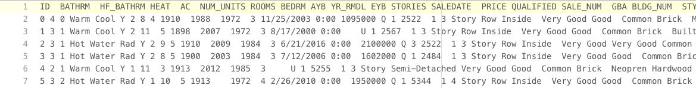
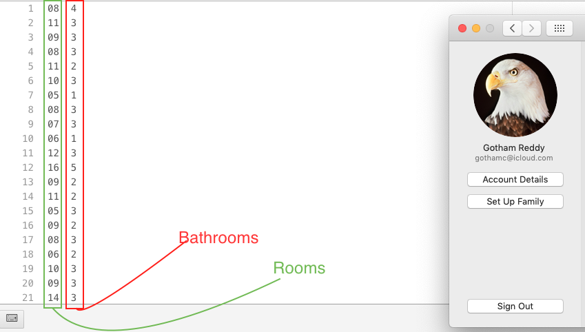
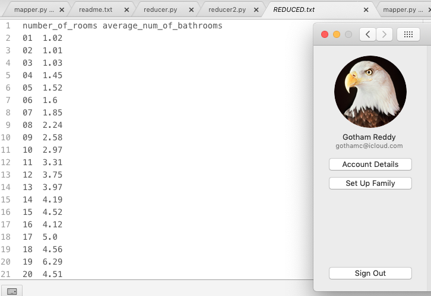
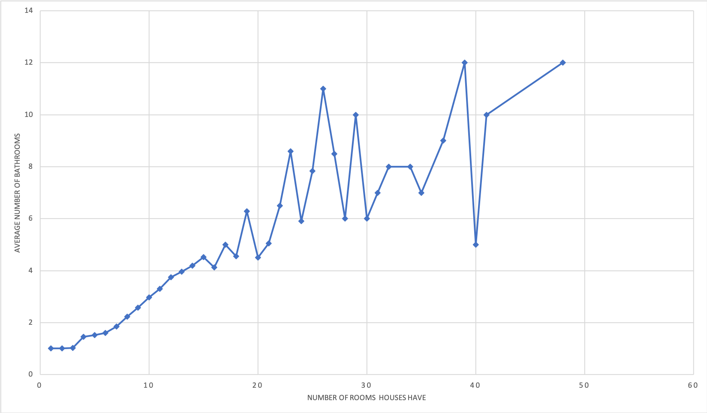

# Data Processing
- Course: BigData
- Project number: 4
- Developer Pair 1- Kyle Thompson, Goutham Neravetla, Sumnima Rana
- Developer Pair 2- Krishna Veni Karri, Pappu Shah


## Links
- [Webpage](https://sumnimarana1.github.io/MapReduceProjectGroup4/ "MapReduce Project group 4")
- [Source](https://github.com/sumnimarana1/MapReduceProjectGroup4 "MapReduce Project group 4")

## Introduction

We are using two datasets in our project.
One is real estate data which is structured data and the other is unstructured data related to social movement metoo.

Dataset 1: WashingtonDC real estate dataset
Dataset 2: 300k #metoo tweets.


## Data Source
- [DC Residential Properties](https://www.kaggle.com/christophercorrea/dc-residential-properties "Website for dataset")
This datasets has analysis showing real property information, including most recent sales price as of July 2018, for properties located Washington, D.C.Data is in CSV format and has 49 columns. Some of the attributes are ID, BATHRMNumber of Full Bathrooms, HF_BATHRM(Number of Half Bathrooms), HEATHeating, ACCooling, NUM_UNITS, etc.

- [#metoo Dataset](https://data.world/rdeeds/350k-metoo-tweets)
This is a data set which has tweets related to social movement metoo from October 2017 to february 2018. Data is in CSV format and has 16 columns. Some of the attributes are tweet_id, tweet text, timestamp of the tweet, handle etc.


## The Challenge

**5 V’s for WashingtonDC Dataset**
- Volume- There are 159K rows and 49 Col and size is 52.81 MB
- Velocity- The last update for the Datasets was done 3 Months ago.
- Value- This datas can be used to predict the property for the future business and help buyers and seller and know if its reasonable for you or not.
- Variety- Pretty structured with numerical and nominal(categorical)
- Veracity- Downloaded from Kaggle dataset which is trusted site for the dataset.

**5 V’s for datasets**
- Volume- The size of the 122.82 MB
- Velocity- Using the API’s we can retrieve approximately 4000 live stream tweets in 30 seconds. The dataset is last updated on February 2018
- Value- This dataset provide insight of impact of social media on society and the swing of the movement.
- Variety- This data is combination of text and numerical data
- Veracity- We downloaded it from DataWorld which is trusted site for the dataset and scrapped using twitter bot. So we think it is accurate.

## Big Data Questions
- Count the number of houses that have more than or equal to 10 rooms and 7 full bathrooms  - Goutham
- Average Price per square foot-Kyle Thomspon
- Calculating average sales in a particular month.- Sumnima Rana
- Find the total number of followers for twitter Handler 'A'- Pappu Sah
- For each tweet find Sentiment and then calculate total number of positive negative and neutral tweets-  Krishna Veni Karri


## Big Data Solutions -DC_Properties

### Kyle:Average Price per square foot-Kyle Thomspon ###
* Mapper Input: DC_Properties.csv


I have three questions. For the distric of columbia what is the miximum, minimum and average price per square foot of housing.

Step 1: Fist I converted the cvs file to a txt file.

Step 2: The data has lots and lots of feilds, I strip out Everything except price and square feet and write
that to a new txt file "mapped.txt".

* Mapper Output/Reducer Input: Price/ Square Feet


Step 3: Then I ran the intermediate values of price and square feet through three seperate algorythms.
All three programs take input from the mapped txt file.
All three programs convert the string input of price and sqrFeet into floats.
Minimum runs through and finds the smallest number Price/sqrfeet for a single line
Maximum runs through and finds the largwst number for Price/sqrfeet for a single line
Average runs through aggregating all the price to total price, and all the sqrfeet for total square feet.
Then outputs the totalPrice/totalSqrFeet.

* Reducer Output: Total Cost / Total Square Feet


* Language: Python

ToRun:
* 1)Navigate to MapReduceProjectGroup4/thompson/Local
* 2)Enter "py mapper.py" into the command line
* 3)Enter "py Vreduce minimum.py maximum.py" into the comand line
* 4)The maximum minimum and average price per square foot are now in the respective files.
* 5)Use excel to visualize those numbers.

Challenges: This whole process took me a couple hours. Most of the problems I faced were technical ones, like when switching between txt editors.
Tabs and spaces would switch, and " " would sometimes read as a tab, sometimes as a space.
The data used had a lot of holes in it. Price only existed on properties that had ben sold recently enough to be on this record.
Sqrfeet of the real estate was often just the value "1" when the actual number was unavailable or did not exist.

Value of Answers: The answers to my questions are most interesting when seen in comparison to one another. The disparity between the average and the maximum is incredible. This information would be valuable for someone buying or developing property in D.C
Though should be supplemented with more information.

How To improve: If I were to do this again I would spend more time examining the furthest outlying value's and checking their validity.
It would also be good to know what percent of the data I did not use because it was not complete.
The minimum value for instance is less than a dollar per square foot, and while I can imagine reasons for that, it is also likely
that I used some invalid outlier data that does not reflect any physical property.
I think if someone wanted to go further with this, they would need to check these numbers against a timeline like Sumnima's and another one by year. The same thing could be done with median and mode, instead of average.
The location in D.C. should also be worked in, as addresses are available, to map out the pattern of these costs.

### Sumnima:Calculating average sales in a particular month ###
* Mapper Input: DC_Properties.csv
 
* Mapper Output/ Reducer Input:: MONTH / PRICE (price of most recent sales)
 
* Reducer Output: Month, Average
 
* Language: Python
* Use: Bar Chart for 12 Months to show the Average sale
Visualization of Data:
 

### Goutham Neravetla: ###

* **Language:** <br />
Python

* **Mapper Input:**<br />
DC.txt(it is a tab seperated file). It has a lot of fields(49 total!). Mapper is going to take this file as input and output ROOMS and BATHRM as key value pairs.<br /><br />

* **Mapper Output/Sorter Input:** <br />
ROOMS and BATHROOMS. <br />

* **Sorter Output/Reducer Input:** <br />
This sorts the mapper output and feeds it into the reducer.<br />

* **Reducer Output:** <br />
 This takes in sorted data and does reduce operation. In this case, for houses in DC area with n rooms, it will get average number of bathrooms.<br /><br />


* **Visualization of data:** <br />
I converted the tablimited file to comma seperated file using a python program i wrote. Then opened it in excel to create the lined scatterplot.<br /><br />


* **To Run:**<br />
Change to **neravetla** folder. Then run ```cat DC.txt | python mapper.py | python sort.py | python reducer.py```<br />
It is better to pipe the output from mapper to reducer. Looks cooler! You should see the output on your screen. I am assuming you can run bash commands. <br />
If you can't run bash commands, there is still a way to run the code. Go to **neravetla/localtest**, run ```python mapper.py```. It should create **MAPPED.txt** file. Now run ```python sort.py```. This should create **SORTED.txt**. Now run ```python reducer.py```. This will create **REDUCED.txt**. You are done! If you want to convert **REDUCED.txt** to csv format, just run ```python csver.py```.

* **Challenges:**<br />
My main Challenge was asking right big data question. I asked the wrong question, and i ended up solving the wrong problem. Once i asked the right question, i struggled with sorting the data by key(number of rooms). Then sumnima told all i have to do is append "0" to keys that are less than 10. After that, it was pretty easy.

* **Value:**<br />
This answers the relationship between number of bathrooms and size of house(by number of rooms it has). It gives sense of how many bathrooms are thought to be adequate by realestate developers.

## Big Data Solutions- MeToo Datasets
### Pappu:Find the total number of followers for twitter Handler 'A' ###
* Mapper Input: metootweets.csv

* Mapper Output/ Reducer Input:Twitter Handle , Followers


* Reducer Output: Twitter Handle, count of Followers
* Language:Python
* Chart: Bar graph

### Krishna Veni:For each tweet find Sentiment and then calculate total number of positive negative and neutral tweets ###
* Mapper Input: metootweets.csv

* Mapper Output/ Reducer Input: tweet id, Text

* Reducer Output::  sentiment, count ({positive, count}, {negative, count}, {neutral, count})
* Language:  Python
* Chart: Pie chart
